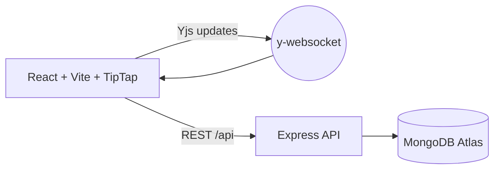

🚀 Document Editor — Real‑time Collaborative Editor

<div align="center">


</div>

— Build once. Edit together. Persist safely. —

• Live Collaboration • Autosave • Phone‑friendly UI • Production‑ready build

---

## Quick Links
- ▶️ Run locally: `client/` + `server/`
- 🌐 Deploy frontend: GitHub Pages (workflow provided)
- 🗄️ Backend: `server/` (Render/other) with `MONGODB_URI`

### Live Demo
- Frontend (GitHub Pages): https://saipranav31.github.io/Document-Editor/

---

## Table of Contents
- [Overview](#overview)
- [Features](#features)
- [Tech Stack](#tech-stack)
- [Quick Start](#quick-start)
- [Architecture](#architecture)
- [API](#api)
- [Deployment](#deployment)
- [Troubleshooting](#troubleshooting)
- [License](#license)

## Screenshots
> Add your own screenshots or GIFs here

<p align="center">
  
</p>

## Badges & Status


## Quick Start

```bash
# Backend
npm --prefix server install
npm --prefix server run dev

# Frontend
npm --prefix client install
npm --prefix client run dev
```

Environment `server/.env` (gitignored):
```bash
MONGODB_URI=mongodb+srv://<user>:<password>@<cluster>/?retryWrites=true&w=majority&appName=<AppName>
PORT=4000
```

## Architecture


## Feature Checklist
- [x] Realtime collaboration (Yjs + y-websocket)
- [x] Autosave + reload
- [x] Mobile-friendly layout
- [x] Toolbar: bold/italic/underline, H2, lists, blockquote, code block, align, color, undo/redo
- [x] GitHub Pages deploy (client)
- [x] Render-ready backend (server)

## Contributing
Contributions are welcome! Please open an issue to discuss any major changes before submitting a PR.
1. Fork the repo
2. Create a feature branch
3. Commit changes following conventional messages
4. Open a pull request

## License
This project is licensed under the **MIT License**.

## Links
- **Live Demo**: https://saipranav31.github.io/Document-Editor/
- **Repository**: https://github.com/saipranav31/Document-Editor
- **Issues**: https://github.com/saipranav31/Document-Editor/issues

## Acknowledgements
- [Vite](https://vitejs.dev/) • [React](https://react.dev/) • [TypeScript](https://www.typescriptlang.org/)
- [TipTap](https://tiptap.dev/) • [ProseMirror](https://prosemirror.net/) • [Yjs](https://yjs.dev/) • [y-websocket](https://github.com/yjs/y-websocket)
- [MongoDB Atlas](https://www.mongodb.com/atlas) • [Express](https://expressjs.com/)
- [Shields.io](https://shields.io/) for badges • [GitHub Actions](https://github.com/features/actions) for CI/CD

## Contact
- Maintainer: [@saipranav31](https://github.com/saipranav31)
- Feel free to open an issue for questions or feature requests.

